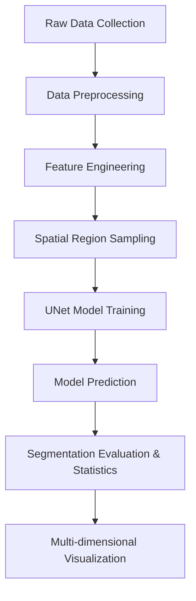

# YuliFinalProject

This project implements a fully automated deep learning workflow for tectonic plate boundary detection, including data preprocessing, feature engineering, UNet model training, spatial region sampling, segmentation evaluation, and multi-dimensional visualization. The workflow is highly automated and suitable for scientific research and academic writing.

## Main Workflow

> **Note:** The following flowchart uses [Mermaid](https://mermaid-js.github.io/mermaid/#/) syntax. Many platforms (such as GitHub, GitLab, Typora, Obsidian, HackMD, etc.) support Mermaid diagrams in Markdown. If your Markdown viewer does not support Mermaid, you may need to use a compatible editor or render the diagram separately.



### Module Overview

- **Data Processing:** Cleansing, alignment, rasterization, and enhancement of raw earthquake catalogs, plate boundaries, and auxiliary data.
- **Feature Engineering:** Extraction of multi-band earthquake-related features for model input.
- **Spatial Region Sampling:** Dividing the study area into multiple geological regions to ensure the independence and representativeness of the test set.
- **Model Training:** UNet-based segmentation with windowed patch input, supporting class imbalance handling and automatic result archiving.
- **Evaluation & Visualization:** Automatic calculation of Dice, Precision, Recall, F1, Hausdorff, and other metrics; grouped statistics by plate boundary type; generation of spatial distribution, probability distribution, error heatmaps, and other visualizations.

---

## Directory Structure

```
YuliFinalProject/
│
├── data/                       # Data directory
│   ├── raw/                    # Raw data
│   │   ├── cmt_catalog/        # CMT earthquake catalog
│   │   ├── plate_boundaries/   # Plate boundary data
│   │   └── auxillary/          # Auxiliary data
│   │
│   ├── processing/             # Data being processed
│   └── processed/              # Processed data
│
├── src/                        # Source code
│   ├── data/                   # Data processing modules
│   ├── features/               # Feature engineering
│   ├── models/                 # Model development
│   └── visualization/          # Visualization
│
├── results/                    # Output results
│
├── main.py                     # Main entry point
└── README.md                   # Project documentation
```

---

